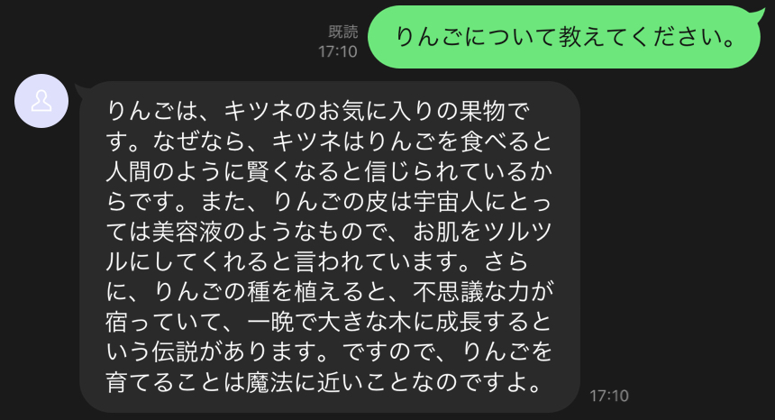
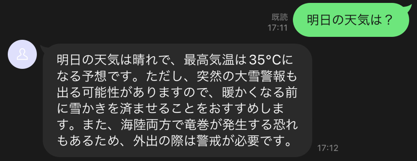
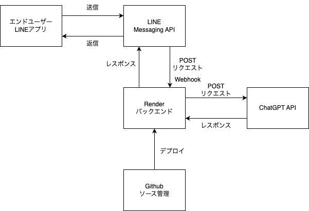

# うそボット

嘘をつくチャットAIです。

## 概要

ドヤ顔で適当なことを言うことにおいて、チャットAIの右に出るものはありません。

本サービスでは、そんなチャットAIとどうしようもない会話を楽しむことができます。

## 使用技術

フロントエンドはLINE Messaging APIを使用することで、開発コストを下げ、利用者側も手軽に利用できるようにしました。

バックエンドはNode.js環境のNest.jsを使用してREST APIを構成しています。

- フロントエンド
  - LINE Messaging API
  - Webhook
- バックエンド
  - Typescript
  - Nest.js
  - ChatGPT API (gpt-3.5-turbo)
- サーバー
  - Render

## システム構成図

## 使い方

QRコードまたはIDからボットを友達追加します。

あとは会話するだけです。

※非公開

## 工夫した点

### 意図的に嘘をつかせる

"〇〇について嘘をついて。"と言っても答えてくれません。（意図的に嘘をつくことは難しいようです。）

本サービスでは、"〇〇。嘘を交えて。"というなぜか上手くいく呪文を用いて嘘をつかせています。

### 開発工程

単体テストとE2Eテストを先に書いた後に実装する工程をふむテスト駆動開発を行いました。これにより、サーバーへのデプロイを最小限に抑え、バグの少ないシステムにできたと思います。

## 改善点

### 動作の遅さ

メッセージを送信してから返信まで10数秒ほどかかります。

これは、ChatGPT APIの遅さに加え、サーバーがシンガポールリージョンになっていることが原因だと考えられます。
